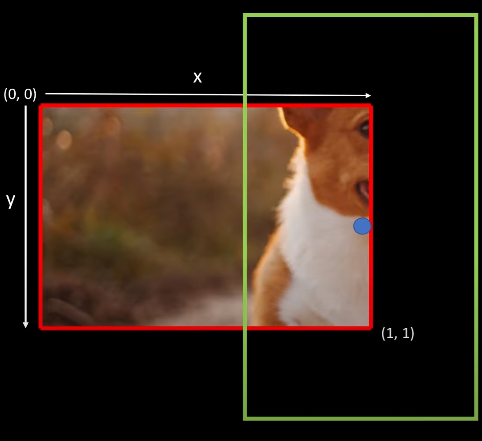

# yolo
YOLO from scratch
## Overview of YOLO algorithm

Dataset YOLO was trained on PASCAL VOC Dataset (20 classes) (most papers use COCO instead)
hộp giới hạn
1. [Idea behind Algorithm](#idea-behind-algorithm)
2. [Model Architeture](#model-architeture)
3. [Loss Function](#loss-function)

## Idea behind Algorithm

Split the image into $S \times S$ (in the [paper](https://arxiv.org/pdf/1506.02640.pdf) $S = 7$).

- Each cell will output a prediction with a corresponding bounding box. Find the cell containing the object's midpoint that responsible for outputing the object.


- Each output and label will be **relative to the cell**. Each bbox for each cell will have $[x, y, w, h]$ where $x, y, w, h$ are coordinates for object for midpoint in cell and the width and height of the object **relative to the cell**.

     
    
    $[x,y,w,h] = 0.97, 0.62,0.7, 1.91$

- How the label acturally look: $label_{cell} = [c_1, c_2,\dots, c_{20}, p_c, x, y, w, h]$, \where $c_i$ are classes, $p_c$ is probability that there is an object, and the remaining is bbox. Target shape for one image $S \times S \times 25$

- Predictions will look similar, except for two bboxes (wide vs tall):
$pred_{cell} = [c_1, c_2,\dots, c_{20}, p_{c_1}, x_1, y_1, w_1, h_1, p_{c_2}, x_2, y_2, w_2, h_2]$. Prediction shape for one image: $S \times S \times 30$

## Model Architeture


Input: Image size $448 \times 448 \times 3$

Output: Tensor of predictions: $7 \times 7 \times 30$

## Loss Function

$\lambda_{coord}\sum_{j=0}^{S^2}\sum_{j=0}^BI_{ij}^{obj}[(x_j-\hat x_i)^2+(y_i-\hat y_i)^2]
+\lambda_{coord}\sum_{j=0}^{S^2}\sum_{j=0}^BI_{ij}^{obj}[(\sqrt{w_j}-\sqrt{\hat w_i})^2+(\sqrt{h_j}-\sqrt{\hat h_i})^2]
+\sum_{j=0}^{S^2}\sum_{j=0}^BI_{ij}^{obj}(C_i-\hat C_i)^2 
+\lambda_{noobj}\sum_{j=0}^{S^2}\sum_{j=0}^BI_{ij}^{noobj}(C_i-\hat C_i)^2  
+\sum_{j=0}^{S^2}\sum_{j=0}^BI_{i}^{obj}\sum_{c \in {classes}}(p_i(c)-\hat p_i(c))^2$

## Data
VOC Dataset
```
data
|___images
|___labels

```
labels: Normalized (class_label, x, y, width, height)

Training:
